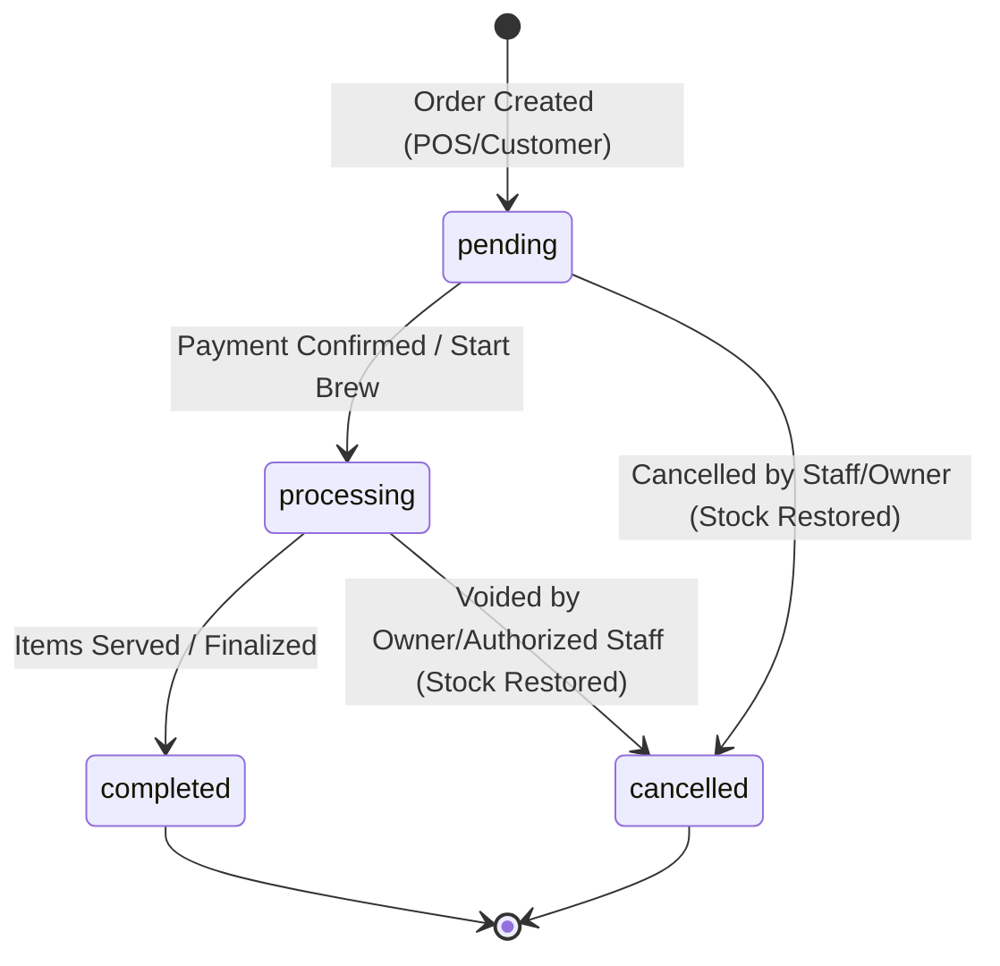

# Crib Society — Business Rules & Logic Specification

> **Status:** Active / Source of Truth (SOT)  
> **Target:** Backend & Frontend Integration  
> **Related Documents:** [PRD.md](file:///c:/laragon/www/crib_society_coffee/backend/docs/PRD.md), [USER-FLOW.md](file:///c:/laragon/www/crib_society_coffee/backend/docs/USER-FLOW.md), [API-SPEC.md](file:///c:/laragon/www/crib_society_coffee/backend/docs/API-SPEC.md)

---

## 1. Overview & Principles
This document defines the definitive business logic, domain rules, calculation formulas, state lifecycles, and access policies for the **Crib Society** coffee shop platform. All API implementations and UI state machines must strictly adhere to these rules.

---

## 2. Role-Based Access Control (RBAC)

### 2.1 Role Definitions
| Role | Code | Scope |
| :--- | :--- | :--- |
| **Guest** | `guest` | Unauthenticated public visitor exploring brand, menu, and promotions. |
| **Staff** | `staff` | Cashier & Barista operational access: POS order creation, processing daily orders, receipt printing. |
| **Owner / Admin**| `owner` | Full operational, managerial, and financial privileges: product catalogue, staff management, analytics, system settings. |

### 2.2 Permissions Matrix

| Feature / Action | Guest | Staff | Owner | Rules & Limitations |
| :--- | :---: | :---: | :---: | :--- |
| **View Landing & Public Menu** | ✅ | ✅ | ✅ | Active products only. |
| **Access POS Screen** | ❌ | ✅ | ✅ | Requires active authenticated session. |
| **Create POS Order** | ❌ | ✅ | ✅ | Associated with the authenticated cashier ID. |
| **Update Order Status** | ❌ | ✅ | ✅ | Staff can transition `pending` → `processing` → `completed`. Staff cannot cancel completed orders. |
| **Cancel / Void Order** | ❌ | ⚠️ *(restricted)* | ✅ | Staff requires prior status `pending`/`processing`; stock must revert. |
| **View Daily Orders (Today's Orders)**| ❌ | ✅ | ✅ | Staff only views orders for the current business date. |
| **View Historical Reports & Sales** | ❌ | ❌ | ✅ | Owner-only; encompasses historical date ranges, AOV, and margins. |
| **Manage Products & Categories** | ❌ | ❌ | ✅ | CRUD on menu items, categories, pricing, stock adjustments. |
| **Manage Staff Accounts** | ❌ | ❌ | ✅ | Create, update, deactivate staff credentials. |
| **System & Tax Settings** | ❌ | ❌ | ✅ | Configure tax rates, service charge, and store operational parameters. |

---

## 3. Product & Inventory Management Rules

### 3.1 Product Attributes & Validation
1. **Name:** Must be unique within the active catalogue (case-insensitive). Length: 3–100 characters.
2. **Category:** Every product must belong to exactly 1 valid Category (`categoryId`).
3. **Price:** Must be an integer or decimal >= 0. Unit is in IDR (Rupiah).
4. **Stock:** Non-negative integer (`stock >= 0`).
5. **Low Stock Threshold:** Default value is `5` units (configurable per product or global setting).
6. **Status Lifecycle:**
   - `active`: Displayed on public menu and available in POS.
   - `inactive`: Hidden from public menu and POS (e.g., seasonal menu disabled).
   - `archived`: Soft-deleted; kept for historical order consistency.

### 3.2 Stock Deduction & Reservation
- **Deduction Timing:** Product stock is deducted immediately upon successful order creation (`POST /orders`).
- **Out of Stock Guard:** If `product.stock < requested_quantity`, order submission is rejected with HTTP `422 Unprocessable Entity` (`INSUFFICIENT_STOCK`).
- **Restock on Cancellation:** When an order is moved to `cancelled`, all deducted items must be restored to their respective product stock immediately within a database transaction.
- **Low Stock Indicator:** When `stock <= low_stock_threshold`, the system flags the product as `low_stock` to increment the `lowStockCount` dashboard metric.

---

## 4. Cart, Pricing & Calculation Rules

### 4.1 Monetary Calculations
All monetary calculations must be executed on the backend with standard rounding rules:
1. **Line Item Subtotal:**
   $$\text{item\_subtotal} = \text{unit\_price} \times \text{quantity}$$
2. **Order Subtotal:**
   $$\text{subtotal} = \sum (\text{item\_subtotal})$$
3. **Discount Amount:**
   - Applicable via voucher code or manual manager discount (if enabled).
   - Must not exceed `subtotal`. Max discount cap applies.
4. **Service Charge (Optional):**
   $$\text{service\_amount} = (\text{subtotal} - \text{discount}) \times \text{service\_rate}$$
5. **Tax (PB1 / Restaurant Tax):**
   $$\text{taxable\_base} = \text{subtotal} - \text{discount} + \text{service\_amount}$$
   $$\text{tax\_amount} = \text{taxable\_base} \times \text{tax\_rate}$$
   *(Default standard PB1 rate is 10% or configured in settings).*
6. **Grand Total:**
   $$\text{total} = \text{subtotal} - \text{discount} + \text{service\_amount} + \text{tax\_amount}$$

### 4.2 Constraints & Rounding
- Quantities must be positive integers (`qty >= 1`).
- Line item pricing reflects the product price at the time the order was placed (historical snapshot).
- Rounding: Total amounts rounded to nearest whole Rupiah (`ROUND(total, 0)`).

---

## 5. Order Lifecycle & State Machine

### 5.1 Order Statuses
- `pending`: Order registered, awaiting payment confirmation (for non-cash/gateway) or initial preparation.
- `processing`: Order is paid / confirmed; barista/kitchen is brewing/preparing items.
- `completed`: Order items served/handed to customer; transaction finalized.
- `cancelled`: Order aborted, voided, or refunded. Stock is restored.

### 5.2 Transition Matrix

| Current Status | Allowed Target Status | Authorized Roles | Trigger / Condition |
| :--- | :--- | :--- | :--- |
| `pending` | `processing` | `staff`, `owner` | Payment confirmed or order accepted into queue. |
| `pending` | `cancelled` | `staff`, `owner` | Customer cancelled, cashier error. Stock returned. |
| `processing` | `completed` | `staff`, `owner` | Items prepared and delivered to customer. |
| `processing` | `cancelled` | `owner` *(or authorized staff)* | Exceptional refund/void. Reason required. Stock returned. |
| `completed` | *None (Terminal)* | - | Cannot be transitioned. Any reversal requires explicit refund record. |
| `cancelled` | *None (Terminal)* | - | Terminal state. No reopening. |

---

## 6. Payment & Receipt Specifications

### 6.1 Payment Methods
1. **Cash (`cash`):**
   - Requires `cash_received >= total`.
   - `change_amount = cash_received - total`.
   - Payment status is instantly set to `paid`.
2. **QRIS (`qris`):**
   - Dynamic or static QR presentation.
   - Marked `paid` upon cashier confirmation or webhook notification.
3. **Debit / EDC (`debit`):**
   - Requires card reference / approval code entry.
4. **Transfer (`transfer`):**
   - For pre-orders or corporate catering.

### 6.2 Receipt Generation Rules
Receipts must be generated/printable immediately following payment confirmation with:
- Store Branding (Crib Society logo, address, contact).
- Unique Order Number (`ORD-YYYYMMDD-XXXX`).
- Cashier Name.
- Date & Timestamp (`YYYY-MM-DD HH:mm:ss`).
- Itemized list: `Name`, `Qty`, `Unit Price`, `Subtotal`.
- Financial breakdown: `Subtotal`, `Discount`, `Tax (10%)`, `Service`, `Grand Total`.
- Payment Detail: `Method`, `Amount Paid`, `Change`.
- Footer note ("Thank you for vibing with Crib Society").

---

## 7. Metrics & Dashboard KPI Formulas

### 7.1 Real-Time Operational Metrics (`/dashboard/summary`)
- **`salesToday`**:
  $$\text{salesToday} = \sum \text{orders.total} \quad \forall \text{ orders with } \text{status} = \text{'completed'} \land \text{DATE(created\_at)} = \text{CURRENT\_DATE}$$
- **`ordersToday`**:
  $$\text{ordersToday} = \text{COUNT}(\text{orders}) \quad \forall \text{ orders with } \text{status} = \text{'completed'} \land \text{DATE(created\_at)} = \text{CURRENT\_DATE}$$
- **`averageOrderValue` (AOV)**:
  $$\text{averageOrderValue} = \begin{cases} \frac{\text{salesToday}}{\text{ordersToday}} & \text{if } \text{ordersToday} > 0 \\ 0 & \text{otherwise} \end{cases}$$
- **`lowStockCount`**:
  $$\text{lowStockCount} = \text{COUNT}(\text{products}) \quad \forall \text{ products with } \text{status} = \text{'active'} \land \text{stock} \le \text{low\_stock\_threshold}$$

### 7.2 Sales Analytics (`/dashboard/sales?period=...`)
- Supported periods: `today`, `7days`, `30days`, `monthly`, `yearly`.
- Excludes `cancelled` and unpaid `pending` orders.

---

## 8. Audit, Integrity & Error Handling Rules

1. **Soft Deletes:**
   - Products with associated order history must **never** be hard-deleted from the database. They must be soft-deleted (`deleted_at` timestamp or `status = 'archived'`) to preserve ledger and receipt integrity.
2. **Concurrency & Race Conditions:**
   - High-concurrency checkout of the last item in stock must use row-level locking (`SELECT ... FOR UPDATE`) or atomic decrement (`UPDATE products SET stock = stock - qty WHERE id = ? AND stock >= qty`).
3. **Data Immutability:**
   - `order_items` stores historical snapshots of `product_name` and `unit_price`. Future price updates in `products` must never alter completed historical orders.
4. **Audit Log:**
   - Any order status modification or cancellation must record `changed_by_user_id`, `previous_status`, `new_status`, and `timestamp`.
