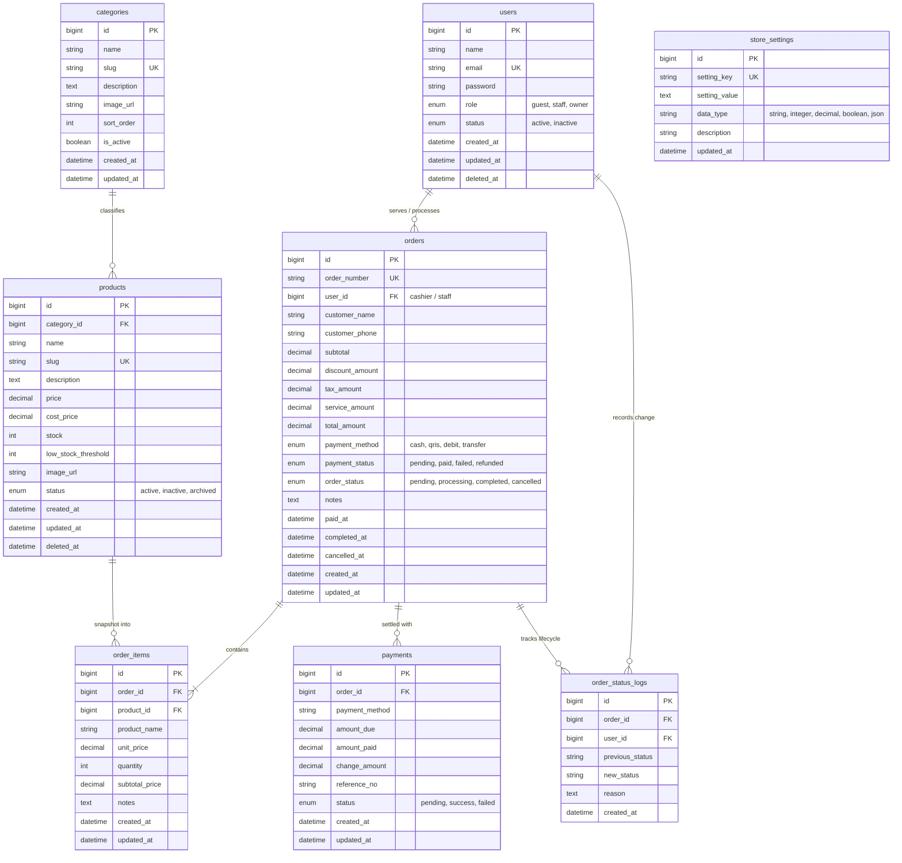

# Crib Society — Database Specification (DATABASE-SPEC)

> **Status:** Active / Source of Truth (SOT)  
> **Database Engine:** MySQL 8.0+ / PostgreSQL 14+ compatible (InnoDB)  
> **Related Documents:** [PRD.md](file:///c:/laragon/www/crib_society_coffee/backend/docs/PRD.md), [USER-FLOW.md](file:///c:/laragon/www/crib_society_coffee/backend/docs/USER-FLOW.md), [API-SPEC.md](file:///c:/laragon/www/crib_society_coffee/backend/docs/API-SPEC.md), [BUSINESS-RULES.md](file:///c:/laragon/www/crib_society_coffee/backend/docs/BUSINESS-RULES.md)

---

## 1. Database Design Conventions

1. **Naming Conventions:**
   - **Tables:** Plural snake_case (`users`, `products`, `orders`).
   - **Columns:** Snake_case (`category_id`, `created_at`, `total_amount`).
   - **Primary Keys:** `id` (BIGINT UNSIGNED AUTO_INCREMENT or UUID v4).
   - **Foreign Keys:** `{singular_table_name}_id` (e.g., `category_id`, `order_id`).
   - **Timestamps:** `created_at`, `updated_at`, and `deleted_at` (for soft deletes).
2. **Character Set & Collation:** `utf8mb4` with `utf8mb4_unicode_ci`.
3. **Monetary Values:** `DECIMAL(12, 2)` or `BIGINT` (in cents / integer Rupiah). Recommended: `DECIMAL(12, 2)` for precision.
4. **Data Integrity:** Strict foreign keys with `RESTRICT` on financial and catalogue historical references; `CASCADE` only on dependent children (like `order_items` when a draft is discarded).

---

## 2. Entity Relationship Diagram (ERD)



---

## 3. Schema Definitions (Tables)

### 3.1 `users`
Stores credentials, roles, and profile state for owners and staff members.

| Column | Type | Nullable | Default | Description |
| :--- | :--- | :---: | :--- | :--- |
| `id` | `BIGINT UNSIGNED` | NO | AUTO_INCREMENT | Primary key |
| `name` | `VARCHAR(100)` | NO | - | Full name of the user |
| `email` | `VARCHAR(150)` | NO | - | Unique login email address |
| `password` | `VARCHAR(255)` | NO | - | Hashed password (Argon2id / bcrypt) |
| `role` | `ENUM('owner', 'staff', 'guest')` | NO | `'staff'` | RBAC role access |
| `status` | `ENUM('active', 'inactive')` | NO | `'active'` | Account activity status |
| `avatar_url` | `VARCHAR(255)` | YES | NULL | Profile image path |
| `remember_token` | `VARCHAR(100)` | YES | NULL | Persistent session token |
| `created_at` | `TIMESTAMP` | YES | CURRENT_TIMESTAMP | Created timestamp |
| `updated_at` | `TIMESTAMP` | YES | CURRENT_TIMESTAMP ON UPDATE | Updated timestamp |
| `deleted_at` | `TIMESTAMP` | YES | NULL | Soft delete timestamp |

**Indexes:**
- `PRIMARY KEY (id)`
- `UNIQUE INDEX idx_users_email (email)`
- `INDEX idx_users_role_status (role, status)`

---

### 3.2 `categories`
Groups products for menu presentation and POS filtering.

| Column | Type | Nullable | Default | Description |
| :--- | :--- | :---: | :--- | :--- |
| `id` | `BIGINT UNSIGNED` | NO | AUTO_INCREMENT | Primary key |
| `name` | `VARCHAR(100)` | NO | - | Category display name (e.g. "Espresso", "Non-Coffee", "Pastry") |
| `slug` | `VARCHAR(120)` | NO | - | URL-friendly unique slug |
| `description` | `TEXT` | YES | NULL | Category overview |
| `image_url` | `VARCHAR(255)` | YES | NULL | Category banner or icon |
| `sort_order` | `INT` | NO | `0` | Order of appearance in POS / Menu |
| `is_active` | `BOOLEAN` | NO | `TRUE` | Toggle visibility |
| `created_at` | `TIMESTAMP` | YES | CURRENT_TIMESTAMP | Creation timestamp |
| `updated_at` | `TIMESTAMP` | YES | CURRENT_TIMESTAMP ON UPDATE | Update timestamp |

**Indexes:**
- `PRIMARY KEY (id)`
- `UNIQUE INDEX idx_categories_slug (slug)`
- `INDEX idx_categories_active_sort (is_active, sort_order)`

---

### 3.3 `products`
The core catalogue item containing pricing, inventory, and status.

| Column | Type | Nullable | Default | Description |
| :--- | :--- | :---: | :--- | :--- |
| `id` | `BIGINT UNSIGNED` | NO | AUTO_INCREMENT | Primary key |
| `category_id` | `BIGINT UNSIGNED` | NO | - | Foreign key referencing `categories(id)` |
| `name` | `VARCHAR(150)` | NO | - | Product item name |
| `slug` | `VARCHAR(180)` | NO | - | URL-friendly unique slug |
| `description` | `TEXT` | YES | NULL | Flavor notes, ingredients, description |
| `price` | `DECIMAL(12, 2)` | NO | `0.00` | Selling price (IDR) |
| `cost_price` | `DECIMAL(12, 2)` | YES | `0.00` | Cost of Goods Sold (COGS) for margins |
| `stock` | `INT` | NO | `0` | Current available stock quantity |
| `low_stock_threshold`| `INT` | NO | `5` | Warning threshold for dashboard KPI |
| `image_url` | `VARCHAR(255)` | YES | NULL | Path or CDN URL to product visual |
| `status` | `ENUM('active', 'inactive', 'archived')` | NO | `'active'` | Catalogue availability state |
| `created_at` | `TIMESTAMP` | YES | CURRENT_TIMESTAMP | Creation timestamp |
| `updated_at` | `TIMESTAMP` | YES | CURRENT_TIMESTAMP ON UPDATE | Update timestamp |
| `deleted_at` | `TIMESTAMP` | YES | NULL | Soft delete timestamp |

**Indexes & Constraints:**
- `PRIMARY KEY (id)`
- `UNIQUE INDEX idx_products_slug (slug)`
- `INDEX idx_products_category (category_id)`
- `INDEX idx_products_status_stock (status, stock)`
- `FOREIGN KEY (category_id) REFERENCES categories(id) ON DELETE RESTRICT ON UPDATE CASCADE`

---

### 3.4 `orders`
Header table for each transaction created through the POS or web order flow.

| Column | Type | Nullable | Default | Description |
| :--- | :--- | :---: | :--- | :--- |
| `id` | `BIGINT UNSIGNED` | NO | AUTO_INCREMENT | Primary key |
| `order_number` | `VARCHAR(32)` | NO | - | Unique public identifier (`ORD-YYYYMMDD-XXXX`) |
| `user_id` | `BIGINT UNSIGNED` | YES | NULL | Cashier/Staff who took the order (`users.id`) |
| `customer_name` | `VARCHAR(100)` | YES | `'Guest'` | Name called out when beverage is ready |
| `customer_phone` | `VARCHAR(30)` | YES | NULL | Optional customer contact |
| `subtotal` | `DECIMAL(12, 2)` | NO | `0.00` | Sum of all line item subtotals |
| `discount_amount`| `DECIMAL(12, 2)` | NO | `0.00` | Total discount applied |
| `tax_amount` | `DECIMAL(12, 2)` | NO | `0.00` | PB1 Restaurant Tax (e.g. 10%) |
| `service_amount` | `DECIMAL(12, 2)` | NO | `0.00` | Optional service fee |
| `total_amount` | `DECIMAL(12, 2)` | NO | `0.00` | Final payable total |
| `payment_method` | `ENUM('cash', 'qris', 'debit', 'transfer')` | NO | `'cash'` | Selected payment channel |
| `payment_status` | `ENUM('pending', 'paid', 'failed', 'refunded')` | NO | `'pending'` | Payment settlement status |
| `order_status` | `ENUM('pending', 'processing', 'completed', 'cancelled')` | NO | `'pending'` | Kitchen / operational status |
| `notes` | `TEXT` | YES | NULL | Order-level special instructions |
| `paid_at` | `TIMESTAMP` | YES | NULL | Timestamp of verified payment |
| `completed_at` | `TIMESTAMP` | YES | NULL | Timestamp order was served/handed over |
| `cancelled_at` | `TIMESTAMP` | YES | NULL | Timestamp order was cancelled/voided |
| `created_at` | `TIMESTAMP` | YES | CURRENT_TIMESTAMP | Order creation timestamp |
| `updated_at` | `TIMESTAMP` | YES | CURRENT_TIMESTAMP ON UPDATE | Update timestamp |

**Indexes & Constraints:**
- `PRIMARY KEY (id)`
- `UNIQUE INDEX idx_orders_order_number (order_number)`
- `INDEX idx_orders_status_date (order_status, created_at)`
- `INDEX idx_orders_user (user_id)`
- `FOREIGN KEY (user_id) REFERENCES users(id) ON DELETE SET NULL ON UPDATE CASCADE`

---

### 3.5 `order_items`
Line items of an order, holding immutable pricing and naming snapshots.

| Column | Type | Nullable | Default | Description |
| :--- | :--- | :---: | :--- | :--- |
| `id` | `BIGINT UNSIGNED` | NO | AUTO_INCREMENT | Primary key |
| `order_id` | `BIGINT UNSIGNED` | NO | - | References `orders(id)` |
| `product_id` | `BIGINT UNSIGNED` | YES | NULL | References `products(id)` (nullified if product archived) |
| `product_name` | `VARCHAR(150)` | NO | - | Snapshot of product name at purchase time |
| `unit_price` | `DECIMAL(12, 2)` | NO | `0.00` | Snapshot of product price at purchase time |
| `quantity` | `INT` | NO | `1` | Quantity ordered (`>= 1`) |
| `subtotal_price`| `DECIMAL(12, 2)` | NO | `0.00` | `unit_price * quantity` |
| `notes` | `VARCHAR(255)` | YES | NULL | Variant modifiers (e.g. "Less sugar, Oat milk") |
| `created_at` | `TIMESTAMP` | YES | CURRENT_TIMESTAMP | Creation timestamp |
| `updated_at` | `TIMESTAMP` | YES | CURRENT_TIMESTAMP ON UPDATE | Update timestamp |

**Indexes & Constraints:**
- `PRIMARY KEY (id)`
- `INDEX idx_order_items_order (order_id)`
- `INDEX idx_order_items_product (product_id)`
- `FOREIGN KEY (order_id) REFERENCES orders(id) ON DELETE CASCADE ON UPDATE CASCADE`
- `FOREIGN KEY (product_id) REFERENCES products(id) ON DELETE SET NULL ON UPDATE CASCADE`

---

### 3.6 `payments`
Details of payments, tendered amounts, change, and external transaction references.

| Column | Type | Nullable | Default | Description |
| :--- | :--- | :---: | :--- | :--- |
| `id` | `BIGINT UNSIGNED` | NO | AUTO_INCREMENT | Primary key |
| `order_id` | `BIGINT UNSIGNED` | NO | - | References `orders(id)` |
| `payment_method` | `VARCHAR(50)` | NO | - | `cash`, `qris`, `debit`, etc. |
| `amount_due` | `DECIMAL(12, 2)` | NO | `0.00` | Amount required to settle |
| `amount_paid` | `DECIMAL(12, 2)` | NO | `0.00` | Cash tendered or digital transfer amount |
| `change_amount` | `DECIMAL(12, 2)` | NO | `0.00` | Change returned (`amount_paid - amount_due`) |
| `reference_no` | `VARCHAR(100)` | YES | NULL | External transaction reference (QRIS / EDC approval) |
| `status` | `ENUM('pending', 'success', 'failed')` | NO | `'pending'` | Settlement status |
| `created_at` | `TIMESTAMP` | YES | CURRENT_TIMESTAMP | Creation timestamp |
| `updated_at` | `TIMESTAMP` | YES | CURRENT_TIMESTAMP ON UPDATE | Update timestamp |

**Indexes & Constraints:**
- `PRIMARY KEY (id)`
- `INDEX idx_payments_order (order_id)`
- `FOREIGN KEY (order_id) REFERENCES orders(id) ON DELETE CASCADE ON UPDATE CASCADE`

---

### 3.7 `order_status_logs`
Audit trail of status transitions for security, operational transparency, and void analysis.

| Column | Type | Nullable | Default | Description |
| :--- | :--- | :---: | :--- | :--- |
| `id` | `BIGINT UNSIGNED` | NO | AUTO_INCREMENT | Primary key |
| `order_id` | `BIGINT UNSIGNED` | NO | - | References `orders(id)` |
| `user_id` | `BIGINT UNSIGNED` | YES | NULL | Actor who changed the status (`users.id`) |
| `previous_status`| `VARCHAR(30)` | YES | NULL | Preceding order status |
| `new_status` | `VARCHAR(30)` | NO | - | Resulting order status |
| `reason` | `TEXT` | YES | NULL | Mandatory reason if cancelled or refunded |
| `created_at` | `TIMESTAMP` | YES | CURRENT_TIMESTAMP | Transition timestamp |

**Indexes & Constraints:**
- `PRIMARY KEY (id)`
- `INDEX idx_status_logs_order (order_id)`
- `FOREIGN KEY (order_id) REFERENCES orders(id) ON DELETE CASCADE ON UPDATE CASCADE`
- `FOREIGN KEY (user_id) REFERENCES users(id) ON DELETE SET NULL ON UPDATE CASCADE`

---

### 3.8 `store_settings`
Key-value configuration store for taxes, operational hours, and system thresholds.

| Column | Type | Nullable | Default | Description |
| :--- | :--- | :---: | :--- | :--- |
| `id` | `BIGINT UNSIGNED` | NO | AUTO_INCREMENT | Primary key |
| `setting_key` | `VARCHAR(80)` | NO | - | Unique parameter key |
| `setting_value`| `TEXT` | YES | NULL | Parameter value |
| `data_type` | `ENUM('string', 'number', 'boolean', 'json')` | NO | `'string'` | Cast type |
| `description` | `VARCHAR(255)` | YES | NULL | Context for owner dashboard settings UI |
| `updated_at` | `TIMESTAMP` | YES | CURRENT_TIMESTAMP ON UPDATE | Update timestamp |

**Default Keys:**
- `tax_rate_percent` (`10.0`)
- `service_charge_percent` (`0.0`)
- `default_low_stock_threshold` (`5`)
- `store_name` (`"Crib Society Coffee"`)
- `receipt_footer_text` (`"Thank you for vibing with Crib Society"`)

---

## 4. Query Optimization & Indexing Strategy

1. **Dashboard KPI Queries (`/dashboard/summary`):**
   - Querying `salesToday` and `ordersToday`:
     ```sql
     SELECT 
         COALESCE(SUM(total_amount), 0) AS sales_today,
         COUNT(id) AS orders_today,
         COALESCE(AVG(total_amount), 0) AS average_order_value
     FROM orders
     WHERE order_status = 'completed'
       AND created_at >= CURDATE() AND created_at < CURDATE() + INTERVAL 1 DAY;
     ```
   - Optimized by compound index: `INDEX idx_orders_status_created (order_status, created_at)`.
2. **Low Stock Detection (`lowStockCount`):**
   - Query:
     ```sql
     SELECT COUNT(id) FROM products WHERE status = 'active' AND stock <= low_stock_threshold;
     ```
   - Optimized by compound index: `INDEX idx_products_status_stock (status, stock)`.
3. **POS Product Lookup by Category & Search:**
   - Query:
     ```sql
     SELECT * FROM products WHERE status = 'active' AND category_id = ? AND name LIKE ? ORDER BY name ASC;
     ```
   - Optimized by `INDEX idx_products_cat_status (category_id, status)`.
